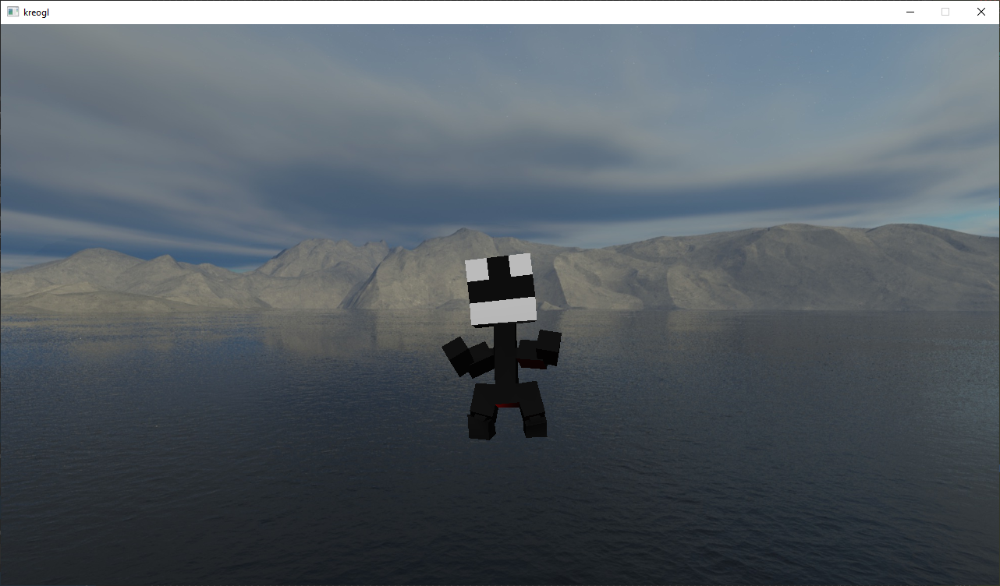

# kreogl

[](https://github.com/phisko/kreogl/actions/workflows/build.yml)

A simple OpenGL renderer, aimed to get any game project up and running with simple but satisfying graphics.

## Motivation

I'm not a graphics programmer and, although I do find it fun when I get pretty things to appear on-screen, I much prefer [metaprogramming](https://github.com/phisko/reflection/) and [engine architecture](https://github.com/phisko/kengine/). However, whenever I've wanted to get some proof-of-concept graphics, I've always been frustrated to see there's no 3D equivalent to [SFML](https://www.sfml-dev.org/): a simple 3D graphics library, letting me load meshes and draw them without having to write my own shaders.

Eventually I came to accept this, and started implementing a custom OpenGL system for the [kengine](https://github.com/phisko/kengine/). This was a learning process for me, as it was my first time toying with graphics programming.

Now that I'm relatively satisfied with the final result (although it's far from perfect), I figured it was time to move the functionality out of the `kengine` and have it become what I was initially looking for, so that future engine programmers don't have to write their own renderer from scratch.

## Usage

Take a look at the [example code](example). There are two examples:
* [a simple one](example/simple_main.cpp) which shows how to quickly draw and animate a model
* [a more complex one](example/complex_main.cpp), which makes use of most available features but may be a bit harder to follow

The examples can be built by setting the `KREOGL_EXAMPLE` CMake option.

Below is a snippet of the important parts of the simple example:

```cpp
kreogl::window window; // create a window
window.get_default_camera().set_position({ 0.f, 0.f, -5.f }); // move the camera back to see the centered scene

kreogl::world world; // the world that will be used to draw into the window

const kreogl::skybox_texture skybox_texture{ // load the skybox
	"resources/skybox/left.jpg",
	"resources/skybox/right.jpg",
	"resources/skybox/top.jpg",
	"resources/skybox/bottom.jpg",
	"resources/skybox/front.jpg",
	"resources/skybox/back.jpg",
};
world.skybox.texture = &skybox_texture; // add it to the world

kreogl::directional_light light; // create a light
world.add(light); // add it to the world
light.direction = { 0.f, -1.f, -1.f };
light.cast_shadows = false; // disable shadows for our scene

const auto model = kreogl::assimp::load_animated_model("resources/funnyman/funnyman.fbx"); // load a 3d model
assert(model && model->animations.size() == 1);

kreogl::animated_object object; // create an object
object.model = model.get(); // base it on the loaded 3d model
object.transform = glm::translate(glm::mat4{1.f}, glm::vec3{ 0.f, -2.5f, 5.f }); // move it forward and down a bit
object.transform = glm::rotate(object.transform, glm::pi<float>(), glm::vec3{ 0.f, 1.f, 0.f }); // rotate it to face the camera
object.animation = kreogl::animation{ // play an animation
	.model = model->animations->animations[0].get(), // use the animation that was baked into the 3d model
	.loop = true
};
world.add(object); // add the object to the world

// main loop
auto previous_time = std::chrono::system_clock::now();
while (!window.should_close()) {
	const auto now = std::chrono::system_clock::now();
	const auto delta_time = float(std::chrono::duration_cast<std::chrono::milliseconds>(now - previous_time).count()) / 1000.f;
	previous_time = now;

	object.tick_animation(delta_time); // play the object's animation

	window.poll_events(); // process input
	window.draw(world); // draw the world into the window
	window.display(); // present the new window contents
}
```

And here's a screenshot of the result:



## API

### High level objects

These are objects that will typically live for as long as the application is running.

* [window](kreogl/window.md)
* [world](kreogl/world.md)
* [camera](kreogl/camera.md)

### Basic drawables

* [object](kreogl/object.md)
* [sprite](kreogl/sprite.md)
* [text](kreogl/text.md)
* [debug_element](kreogl/debug_element.md)

### Lights

* [directional_light](kreogl/lights/directional_light.md)
* [point_light](kreogl/lights/point_light.md)
* [spot_light](kreogl/lights/spot_light.md)

### Loaders

These provide functions to load [models](kreogl/model/model.md) from files.

* [assimp](kreogl/loaders/assimp/assimp.md)
* [polyvox](kreogl/loaders/polyvox/polyvox.md)

### Animation

* [animated_object](kreogl/animation/animated_object.md)

The rest of these types are less user-facing, and understanding them isn't required for basic animation code.

* [animated_model](kreogl/animation/animated_model.md)
* [animation](kreogl/animation/animation.md)
* [animation_file](kreogl/animation/animation_file.md)
* [animation_model](kreogl/animation/animation_model.md)
* [skeleton](kreogl/animation/skeleton.md)
* [skeleton_model](kreogl/animation/skeleton_model.md)

## Implementation details

This describe the internal implementation of the rendering engine. You don't need to be aware of these to make use of `kreogl`, but if you wish to improve/extend/understand its behavior, this is a good starting point.

### [viewport](kreogl/impl/viewport.md)

Each [camera](kreogl/camera.md) has an associated viewport, which represents the on-screen area used to display the camera.

### [gbuffer](kreogl/impl/gbuffer.md)

Each [viewport](kreogl/impl/viewport.md) has an underlying G-buffer, which contains the intermediate rendering data generated when drawing the camera content. It can be used to query the position, color, or custom user data that was drawn in a specific pixel.

### [RAII](https://en.cppreference.com/w/cpp/language/raii) wrappers to OpenGL resources

* [buffer](kreogl/impl/raii/buffer.md)
* [frame_buffer](kreogl/impl/raii/frame_buffer.md)
* [scoped_bind_framebuffer](kreogl/impl/raii/scoped_bind_framebuffer.md)
* [scoped_gl_feature](kreogl/impl/raii/scoped_gl_feature.md)
* [texture](kreogl/impl/raii/texture.md)
* [vertex_array](kreogl/impl/raii/vertex_array.md)

### Shadow maps

* [shadow_map](kreogl/impl/shadow_maps/shadow_map.md)
* [shadow_cube](kreogl/impl/shadow_maps/shadow_cube.md)
* [cascaded_shadow_map](kreogl/impl/shadow_maps/cascaded_shadow_map.md)

### Textures

* [texture_data](kreogl/impl/texture/texture_data.md)
* [skybox_texture](kreogl/impl/texture/skybox_texture.md)

### Shapes

* [box](kreogl/impl/shapes/box.md)
* [line](kreogl/impl/shapes/line.md)
* [quad](kreogl/impl/shapes/quad.md)
* [sphere](kreogl/impl/shapes/sphere.md)
* [textured_quad](kreogl/impl/shapes/textured_quad.md)

### Shaders

Shaders are instances of [shader](kreogl/impl/shaders/shader.md), grouped into a [shader_pipeline](kreogl/impl/shaders/shader_pipeline.md), which can be passed to `window::draw`. The default pipeline contains all the pre-implemented shaders:

#### gbuffer shaders

These are shaders in charge of filling the [gbuffer](kreogl/impl/gbuffer.md).

* [position_color_shader](kreogl/impl/shaders/gbuffer/position_color/position_color_shader.md)
* [skeletal_textured_shader](kreogl/impl/shaders/gbuffer/skeletal_textured/skeletal_textured_shader.md)
* [debug_shader](kreogl/impl/shaders/gbuffer/debug/debug_shader.md)
* [sprite_shader](kreogl/impl/shaders/gbuffer/sprite/sprite_shader.md)
* [text_shader](kreogl/impl/shaders/gbuffer/text/text_shader.md)

#### Lighting shaders

These are shaders in charge of applying lighting to what was previously written into the [gbuffer](kreogl/impl/gbuffer.md), and writing the result to the main framebuffer.

* [directional_light_shader](kreogl/impl/shaders/lighting/directional_light/directional_light_shader.md)
* [point_light_shader](kreogl/impl/shaders/lighting/point_light/point_light_shader.md)
* [spot_light_shader](kreogl/impl/shaders/lighting/spot_light/spot_light_shader.md)

#### Post-lighting shaders

These are shaders that run after the lighting pass, and can render effects to alter the lighting of the scene.

* [volumetric_directional_light](kreogl/impl/shaders/post_lighting/volumetric_lighting/volumetric_directional_light/volumetric_directional_light_shader.md)
* [volumetric_point_light](kreogl/impl/shaders/post_lighting/volumetric_lighting/volumetric_point_light/volumetric_point_light_shader.md)
* [volumetric_spot_light](kreogl/impl/shaders/post_lighting/volumetric_lighting/volumetric_spot_light/volumetric_spot_light_shader.md)

#### Post-process shaders

These are shaders that run after the post-lighting pass, and can add the "final touches" to the scene.

* [light_sphere_shader](kreogl/impl/shaders/post_process/light_sphere/light_sphere_shader.md)
* [skybox_shader](kreogl/impl/shaders/post_process/skybox/skybox_shader.md)

#### Shadowmap shaders

These are shaders that implement the [shadow_map_shader](kreogl/impl/shaders/shadow_map/shadow_map_shader.md) or [shadow_cube_shader](kreogl/impl/shaders/shadow_map/shadow_cube_shader.md) interfaces, and are called by the lighting shaders to fill lights' [ShadowMaps](kreogl/impl/shadow_maps/shadow_map.md).

* [position_shadow_map_shader](kreogl/impl/shaders/shadow_map/position_shadow_map/position_shadow_map_shader.md)
* [position_shadow_cube_shader](kreogl/impl/shaders/shadow_map/position_shadow_cube/position_shadow_cube_shader.md)
* [skeletal_shadow_map_shader](kreogl/impl/shaders/shadow_map/skeletal_shadow_map/skeletal_shadow_map_shader.md)
* [skeletal_shadow_cube_shader](kreogl/impl/shaders/shadow_map/skeletal_shadow_cube/skeletal_shadow_cube_shader.md)

## Profiling

The code is instrumented using [Tracy](https://github.com/wolfpld/tracy). Profiling can be enabled by setting the `KREOGL_PROFILING` CMake option.